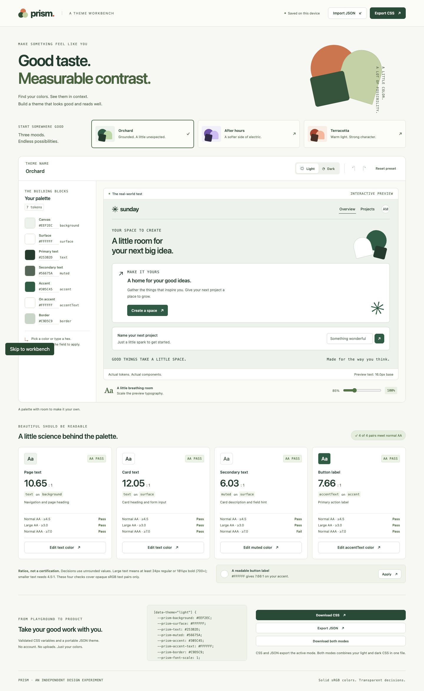

# Prism

**Good taste. Measurable contrast.** A local theme studio that turns seven colors into a real interface, measures the exact text pairs you see, and exports clean CSS variables or a portable JSON theme.



[See the mobile workbench](docs/screenshots/mobile.png)

**[Open the live demo](https://nen-io.github.io/prism-theme-lab/)** · [CI checks](https://github.com/nen-io/prism-theme-lab/actions)

## Start the studio

Requires Node 24.19+ and npm.

```sh
npm ci
npm run dev
```

Open `http://127.0.0.1:4306`. No login, API key, backend, external font or network asset is required. Imported content stays in your browser.

## A two-minute walkthrough

1. Choose **Orchard**, **After hours** or **Terracotta**. Each has independently designed light and dark tokens.
2. Edit **Accent** with a native picker or a six-digit hex value. Hex changes apply on Enter or blur; invalid drafts stay visible without changing the theme.
3. Give **On accent** the same color. The button and its measured ratio become unreadable: **1.00:1, AA fail**.
4. Each contrast card links to its exact color field. A failing pair offers a black/white suggestion only when every measured pair sharing that foreground can pass; the projected ratios make shared effects explicit. Apply a suggestion and undo it to compare.
5. Switch to dark mode, edit it, and return to light. Your light edits remain. Undo/redo tracks up to 50 committed edits; reset restores both preset modes and can itself be undone.
6. Adjust the text scale, export CSS/JSON, and reimport the JSON. CSS/JSON exports contain the active mode; **Download both modes** combines your independent light and dark CSS into one file.
7. Try the sample product: **Create a space** focuses the project-name field, and submitting displays your text inside the card. This small preview state is session-only.

Themes save locally as one validated, versioned workspace containing both modes. Corrupt storage falls back to Orchard with a warning; blocked storage leaves editing and export available. Multiple tabs use last-write-wins local saving, with no live synchronization.

## What gets measured

| Pair                    | Actual preview use                           | Normal-text AA |
| ----------------------- | -------------------------------------------- | -------------- |
| `text` / `background`   | Navigation and page heading                  | ≥4.5:1         |
| `text` / `surface`      | Card heading, form label and input           | ≥4.5:1         |
| `muted` / `surface`     | Card description, field hint and placeholder | ≥4.5:1         |
| `accentText` / `accent` | Primary button and form action               | ≥4.5:1         |

The panel also shows large-text AA at 3:1 and normal-text AAA at 7:1. Large means at least 24 CSS px regular or 18⅔ CSS px bold (700+). Smaller UI text still needs 4.5:1. A displayed rounded ratio never determines a pass: 4.4999 remains a fail even if shown as 4.50. These thresholds follow [W3C's contrast guidance](https://www.w3.org/WAI/WCAG22/Understanding/contrast-minimum.html).

This is **contrast checking, not accessibility certification**. It does not evaluate focus contrast, non-text boundaries, gradients, transparency, images, color-vision differences, screen readers or every state of your real application. Editing a palette can deliberately create failures; the surrounding editor retains its own colors.

## Use an exported theme

CSS uses a fixed selector based only on the validated mode. Names never become CSS selectors, property names or comments.

```html
<link rel="stylesheet" href="prism-light.css" />
<section class="product" data-theme="light">
  <h1>Your next good idea</h1>
  <article class="card">
    <p class="muted">A little room to get started.</p>
    <button>Make a space</button>
  </article>
</section>
```

```css
.product {
  background: var(--prism-background);
  color: var(--prism-text);
  font-size: calc(1rem * var(--prism-font-scale));
}
.card {
  background: var(--prism-surface);
  border: 1px solid var(--prism-border);
  color: var(--prism-text);
}
.muted {
  color: var(--prism-muted);
}
.card button {
  background: var(--prism-accent);
  color: var(--prism-accent-text);
  border: 1px solid var(--prism-accent);
  font: inherit;
}
```

The exported variables are tokens, not a complete component stylesheet. [The component source](src/components/Preview.tsx) and [preview styles](src/styles.css) show the actual integration. [Example JSON and CSS](fixtures/) are included.

## Scripts

| Command             | Purpose                                                |
| ------------------- | ------------------------------------------------------ |
| `npm run dev`       | Local Vite studio on port 4306                         |
| `npm run typecheck` | Strict TypeScript checking                             |
| `npm test`          | Contrast math, validation, history and storage tests   |
| `npm run build`     | Typecheck and relative-base production build           |
| `npm run check`     | Typecheck, unit tests and production build             |
| `npm run test:e2e`  | Chromium journeys, import races and actual screenshots |
| `npm run format`    | Format source, tests and docs with pinned Prettier     |

Install matching Chromium once using `npx playwright install chromium`. Vite uses a relative asset base so the build supports GitHub repository subpaths. The live demo above uses the same repository-subpath build.

## Boundaries and engineering notes

Seven opaque six-digit sRGB colors, font scale 0.85–1.40, 48-character display names, 32 KiB maximum import and 50 undo steps. Import accepts a strict version 1 theme, applies its declared mode and preserves the other mode. A newer edit/preset/mode selection cancels an outstanding file read's authority to commit. No arbitrary CSS, remote URL import, accounts, analytics or third-party processing.

This is a new public demonstration built with AI assistance and executable verification, not a claim of an earlier production product or unaided authorship. It includes no private application or employer source.

- [Architecture, module map and action walkthrough](docs/ARCHITECTURE.md)
- [Design study](docs/DESIGN.md)
- [Security model](docs/SECURITY.md)
- [Scale and resource limits](docs/SCALABILITY.md)
- [Six architecture decisions](docs/DECISIONS.md)
- [Test evidence and limits](docs/TESTING.md)
- [Asset provenance](docs/ASSETS.md)

MIT licensed. See [LICENSE](LICENSE).
