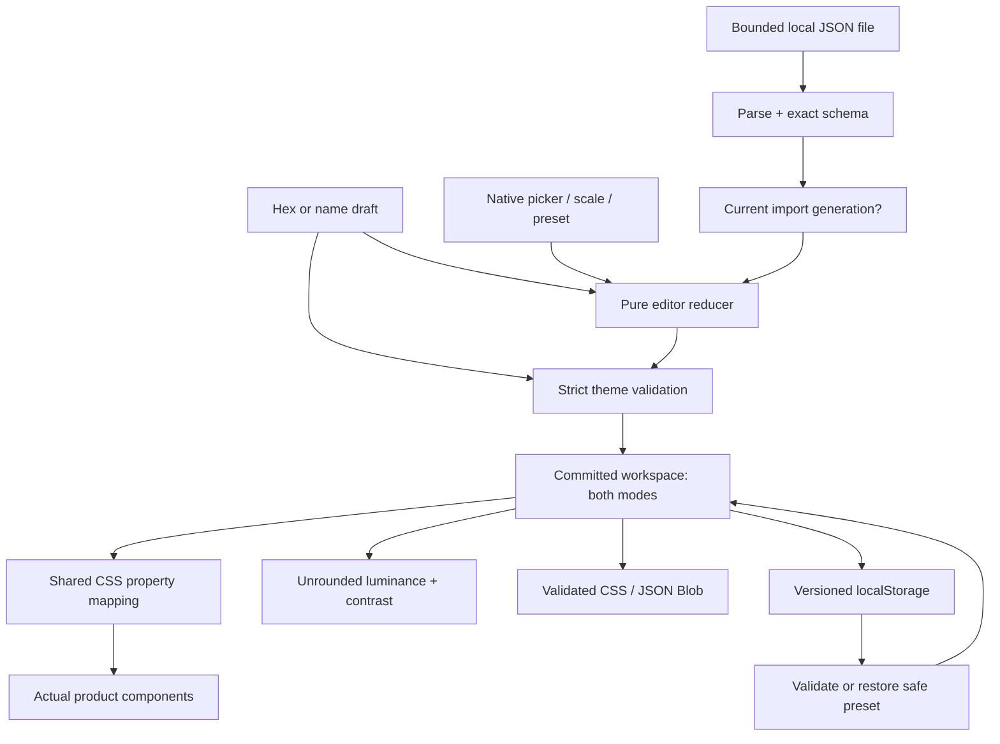

# Architecture

## One validated model, two views

The workbench has no server. It shares one validated theme model across preview, contrast assessment, local saving and export. Editor chrome uses fixed colors so an intentionally unreadable theme cannot hide its repair controls.

## Concrete edit walkthrough

The user types `#123` into the Accent hex field. This remains a local draft. On blur or Enter, `validateHex` rejects it and the field shows a readable error while the committed theme, preview, ratios, export and saved state keep their prior valid color. Entering `#123456` passes; `editorReducer` validates the whole updated theme and records a bounded history snapshot. `cssProperties` maps tokens to the exact custom properties used by the live preview. `assess` measures those same token pairs without reading pixels. A React effect attempts to save the complete workspace; any storage failure becomes a visible nonfatal warning.

Choosing **Apply** in the suggestion panel explicitly commits either black or white, whichever has greater measured contrast against the current accent. It does not adjust the accent or silently repair any other pair.

## Data contracts

`Theme` contains exactly `version:1`, `name`, `mode`, `tokens` and `fontScale`. Tokens contain exactly `background`, `surface`, `text`, `muted`, `accent`, `accentText`, `border`. Hex colors normalize to uppercase. Values with alpha, CSS functions, short hex or arbitrary properties are rejected. Names support a restricted Unicode letter/number/simple-punctuation set and never enter CSS generation.

A saved `Workspace` contains version 1, known preset ID, active mode and independently validated light/dark themes. Their internal mode labels must match their slots. Undo/redo snapshots contain both modes; history is memory-only and capped at 50. Selecting a mode is navigation and is not separately added to history, while import, preset, reset, color, name and scale changes are committed edits. Undo can restore the mode associated with the earlier edit. A new edit clears redo.

## Import authority

The file size is checked before `File.text()`, and decoded text is checked again against the UTF-8 bound before parsing. Each read captures an increasing generation. Any subsequent editor action increments the generation, so an old completion cannot replace a newer choice. Another import and component unmount also invalidate old work. This does not cancel the operating system's file read; it prevents an obsolete result from committing. JSON parsing itself is synchronous and bounded to 32 KiB.

## Contrast math

For each 8-bit sRGB channel, `c = channel / 255`. Linearized channel is `c/12.92` for `c ≤ 0.04045`, otherwise `((c + 0.055)/1.055)^2.4`. Relative luminance is `0.2126R + 0.7152G + 0.0722B`. Contrast is `(max(L1,L2)+0.05)/(min(L1,L2)+0.05)`. The four assessment pairs are explicitly declared in `PAIRS`; the preview and export both consume the same seven validated tokens.

Only display formatting rounds a ratio. Large-text criteria are separate from normal AA; the UI never declares a small button safe merely because its pair passes 3:1. Normal AA is the headline decision for every assessed pair, which is conservative for headings that qualify as large. Default preview base is 1rem, multiplied by the theme scale; individual components use em units. Actual rendered CSS size and weight determine whether a specific element qualifies as large.

## Module map

| Module                             | Responsibility                                                           |
| ---------------------------------- | ------------------------------------------------------------------------ |
| `src/domain/theme.ts`              | Strict schemas, bounds, hex validation, CSS properties and import/export |
| `src/domain/contrast.ts`           | Luminance, contrast, thresholds, pair definitions and foreground choice  |
| `src/domain/presets.ts`            | Original light/dark palettes and safe workspace construction             |
| `src/domain/editor.ts`             | Pure ordered commits, mode handling and bounded undo/redo                |
| `src/domain/storage.ts`            | Validated versioned persistence with failure fallback                    |
| `src/components/TokenEditor.tsx`   | Independent drafts and native color controls                             |
| `src/components/Preview.tsx`       | Actual token-bound navigation, card, input and button                    |
| `src/components/ContrastPanel.tsx` | Four measured pairs and explicit suggestion action                       |
| `src/App.tsx`                      | File-read generation, export lifecycle, saving effect and UI wiring      |

## Official sources consulted

Checked 17 September 2026:

- [W3C WCAG 2.2 relative luminance](https://www.w3.org/TR/WCAG22/#dfn-relative-luminance) — channel transfer and luminance coefficients.
- [W3C contrast minimum understanding](https://www.w3.org/WAI/WCAG22/Understanding/contrast-minimum.html) — AA thresholds, large-text size, unrounded decisions and practical limits.
- [React useReducer](https://react.dev/reference/react/useReducer) — pure state transitions and queued actions.
- [MDN localStorage](https://developer.mozilla.org/en-US/docs/Web/API/Window/localStorage) — origin-local behavior and failure conditions.
- [Vite static deployment](https://vite.dev/guide/static-deploy.html) — static output and relative asset base.
- [Playwright web server](https://playwright.dev/docs/test-webserver) — controlled local browser testing.
- [Prettier installation](https://prettier.io/docs/install) — pinned formatter.

Exact package versions and resolved dependencies are recorded in package.json and package-lock.json. Node 24.19.0 was used for local verification. No framework requirement is inferred from a private project.

## Contrast-to-edit and paired export

`foregroundSuggestion` derives the related measured pairs from the existing PAIRS table and evaluates only two fixed candidates. `ContrastPanel` renders projected effects; App routes explicit selection through the existing editor reducer. Edit-color actions target known token input IDs, focus first and scroll with reduced-motion handling. No theme mutation occurs on navigation. Both-mode CSS export calls `exportCss` separately for each committed mode and joins the outputs; single-mode JSON import/export remains unchanged.
