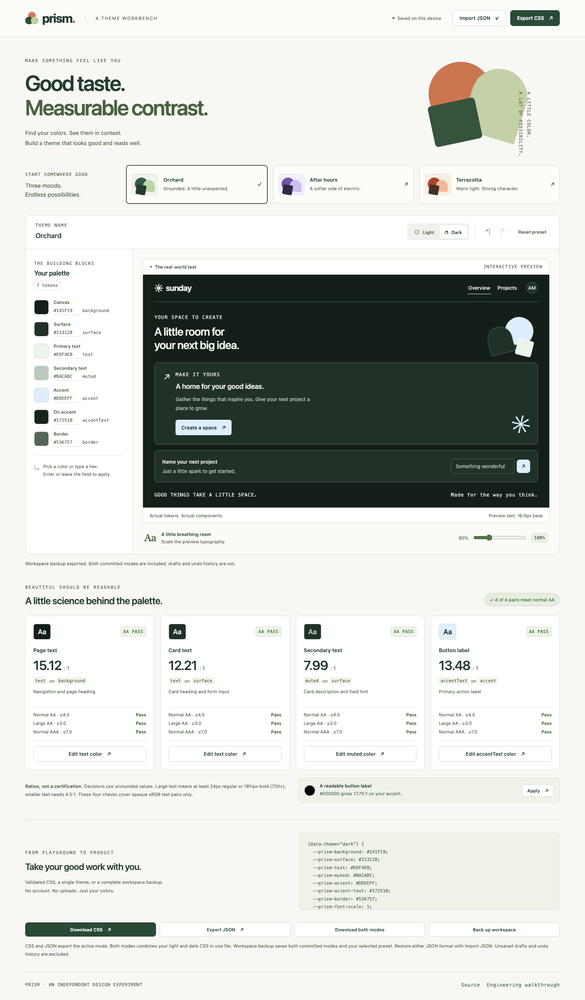

# A three-minute engineering review

Prism is a new AI-assisted portfolio demonstration of token editing, accessible color analysis and strict data boundaries. It uses real contrast calculations; it does not certify a whole interface as accessible.

## Try the behavior

Open the [demo](https://nen-io.github.io/prism-theme-lab/). Change the Accent color in Light mode, switch to Dark and change it independently. Choose **Back up workspace** near the bottom. Reset the preset, then restore the downloaded file with **Import JSON**. Both colors, selected mode and preset identity return together. Undo restores the pre-import workspace; Redo restores the backup.

**Export JSON** still exports only the active theme. Its import preserves your other mode. Backups contain committed values, not unsaved field drafts or undo history. No file leaves your browser.

## Inspect the boundary

[Transfer parsing](../src/domain/transfer.ts) chooses one schema, then validates every property through [the theme boundary](../src/domain/theme.ts). Unknown keys, mismatched modes, invalid colors and files over 32 KiB fail atomically. The [editor reducer](../src/domain/editor.ts) commits a workspace as one undoable transition. Newer draft intent defeats a delayed file read.

[Domain tests](../tests/workspace.test.ts) verify strict roundtrips; [browser journeys](../tests/e2e/workspace.spec.ts) download real JSON, import it, navigate history and reload. With Node 24.19+, run `npm ci` and `npm run check`; install Chromium and run `npm run test:e2e` for UI checks.

Read [decisions](DECISIONS.md), [security](SECURITY.md) and [scalability](SCALABILITY.md) for the tradeoffs. Local storage is plaintext and last-write-wins across tabs. Solid sRGB token pairs do not establish keyboard, screen-reader or full-page accessibility compliance.
